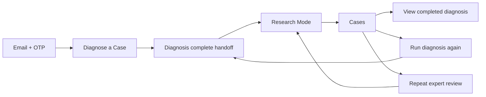
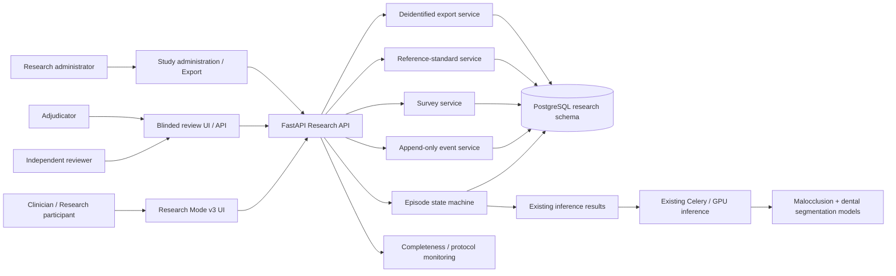
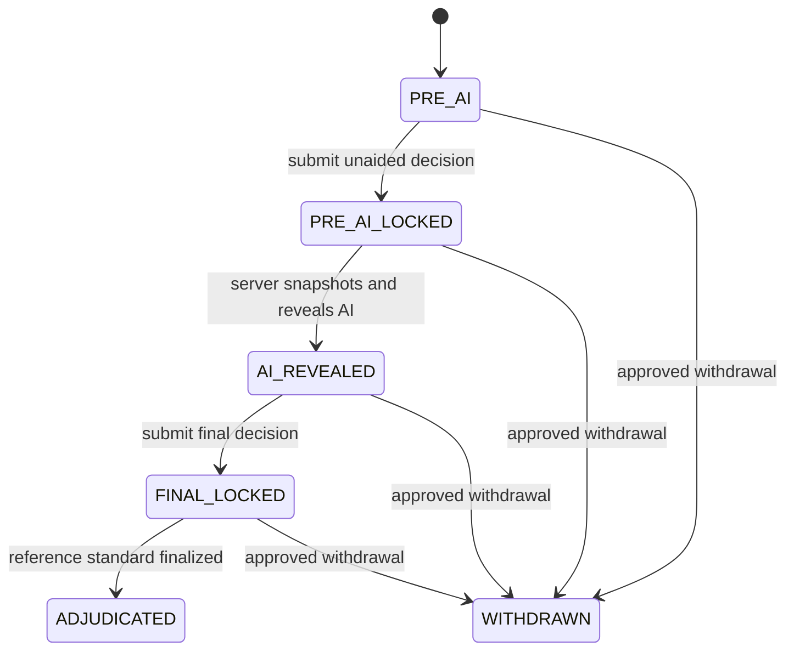
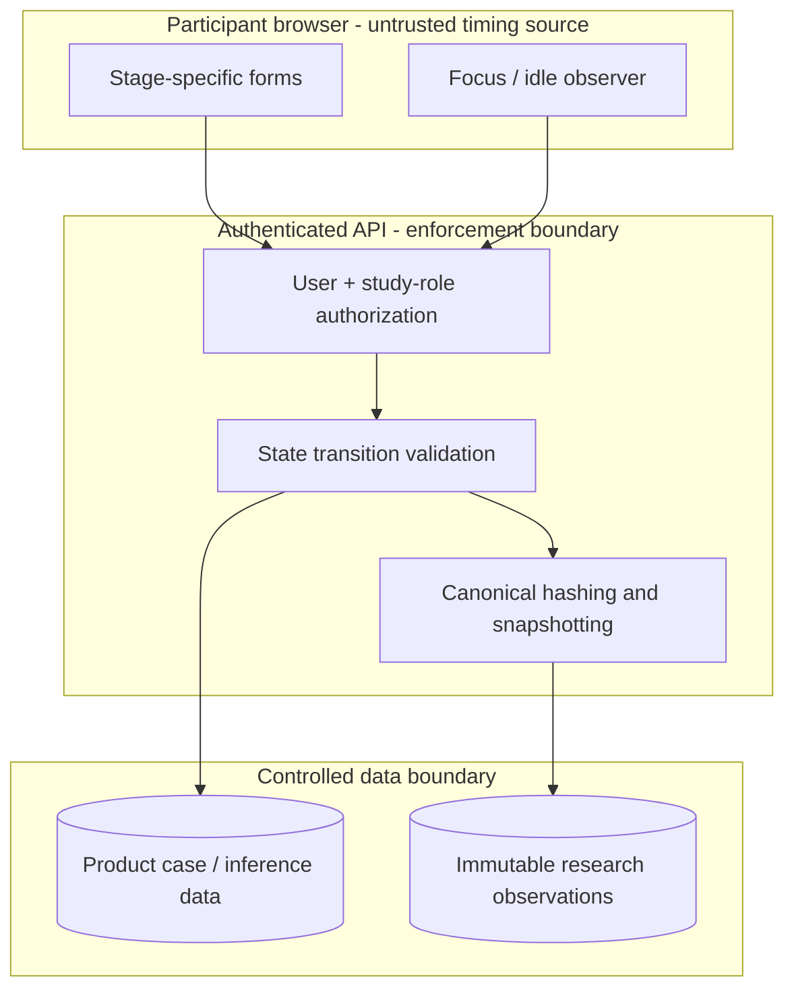

# OrthoAI Research Mode v3

## High-level architecture and component responsibilities

**Status:** Implementation architecture
**Purpose:** Prospective HCI and clinical-AI pilot instrumentation
**Primary design constraint:** No AI-derived information may reach the clinician before the server has persisted and locked the unaided assessment.

Research Mode v3 is a governed study workflow embedded in one participant-facing
journey. It reuses the authenticated case, image, and inference infrastructure,
but it does not reuse the mutable clinical-validation record as a research
source of truth.

Only `Diagnose a Case`, `Research Mode`, and `Cases` appear in the participant
navigation. Independent review, adjudication, study administration, and export
remain role-protected research operations; they are not presented as competing
destinations in the clinician journey.

## Component overview

### 1. Research Mode frontend

The participant enters `/research` from a completed diagnosis, and the case ID
is carried into the study automatically. The experience presents one stage at a
time:

1. owner-only source images and a short blank independent assessment;
2. automatic server lock followed immediately by the AI comparison;
3. a final decision pre-filled from the clinician’s own initial assessment;
4. a conditional micro-follow-up only when a prespecified trigger fires;
5. automatic handoff to the completed record on `/cases`.

It never fetches the ordinary case-results endpoint during the pre-AI stage.
Source-image endpoints return no AI payload, inference metadata, or patient
identifier. The application waits until the governed role is known before
requesting operational case data. Clinicians do not browse a separate research
queue: the diagnosis handoff creates or resumes the episode for that exact case.
Focus, visibility, idle, reveal, inspection, edit, and submission events are
sent to the event service with idempotency keys.

The same route resolves to a role-specific workspace. Reviewers receive only
research-coded source images and a blank independent assessment. Adjudicators
receive source images plus the independent reviews, but not the treating
clinician's decision or AI snapshot. Administrators manage protocol-bound
participant roles and exports. Role separation prevents administrators from
submitting clinical, reviewer, or adjudicator observations. These workspaces are
role-routed destinations, not universal navigation tabs in the clinician header.

### 2. Research API

The FastAPI router is the only supported interface to research records. It authenticates the application user, resolves their governed study participant, verifies site and role membership, checks case ownership or study authorization, and applies state-transition rules.

Separate endpoints accept pre-AI decisions, reveal requests, final decisions, survey responses, reference reviews, adjudications, and corrections. A single combined “manual plus AI” payload is deliberately not supported.

### 3. Episode state machine

Each clinician-case encounter is a decision episode.

The state machine prevents:

- result leakage before pre-AI lock;
- duplicate or out-of-order submissions;
- mutation of locked observations;
- reveal without a completed inference result;
- adjudication without the configured minimum independent reviews.

### 4. PostgreSQL research schema

The research schema stores governed identities and immutable observations:

| Component | Role |
|---|---|
| `research_studies` | Protocol identity, status, task, consent version, and study configuration. |
| `research_sites` | Governed clinic identity and timezone. |
| `research_epochs` | Frozen protocol, decision-task schema, UI, model, threshold, and policy version for an analysis period. |
| `research_participants` | Pseudonymous participant identity, site, role, experience band, consent, and withdrawal state. |
| `research_episodes` | Case encounter, assigned condition, exposure index, immutable attempt index, repeat lineage, state, and transition timestamps. |
| `pre_ai_decisions` | Locked unaided assessment and confidence. |
| `ai_reveals` | Exact immutable AI payload and provenance shown to the clinician. |
| `final_decisions` | Locked post-AI decision, confidence, reliance behavior, and rationale. |
| `research_events` | Ordered interaction and timing telemetry. |
| `study_instruments` | Versioned researcher-configured survey definitions and schedules. |
| `survey_responses` | Append-only responses, timing, version, and missingness. |
| `reference_assessments` | Independent, role-protected reviewer labels. |
| `adjudications` | Final reference standard, uncertainty, and rationale. |
| `research_corrections` | Append-only corrections that preserve the original observation. |

Foreign-key deletion restrictions keep research observations from disappearing when ordinary product records are cleaned up. Public API routes do not expose update or delete operations for immutable records.

### 5. AI reveal snapshot service

The reveal service reads the latest completed inference only after the pre-AI lock. It creates a canonical snapshot containing:

- model and result schema versions;
- build and artifact provenance;
- prediction, evidence, masks, and thresholds actually displayed;
- inference-result identifier and timestamp;
- canonical payload hash;
- exact reveal timestamp.

Later model reruns cannot alter what the clinician saw during an earlier episode.

### Traceable repeat behavior

“Run diagnosis again” creates a new inference job and preserves prior inference
results. “Repeat research review” creates a new research episode with an
incremented `attempt_index` and a `repeat_of_episode_id` link. The original
pre-AI decision, AI snapshot, final decision, surveys, and events remain
immutable. The first event in the new episode records the repeat reason code,
exposure index, UI version, and epoch.

### 6. Event and timing service

Research timing is derived from the ordered event ledger rather than from a self-entered duration or inference latency. Events carry:

- event UUID and per-episode sequence;
- idempotency key;
- server and client timestamps;
- timezone offset;
- study participant and episode;
- event type and versioned payload.

Infrastructure latency remains available as a separate system-performance measure. Active clinician time is derived during analysis using prespecified focus, visibility, and idle rules.

### 7. Survey service

Survey definitions are versioned data rather than hard-coded assumptions. A principal investigator or authorized research administrator supplies the approved wording, response options, translations, cadence, and scoring specification. The platform records invitation, start, completion, missingness, instrument version, and episode/period linkage.

The case-level `ai-influence-micro` instrument is scheduled by the server. A
reason prompt appears after a decision change, disagreement with the AI, or a
confidence shift of at least 20 points. A usefulness pulse is sampled at the
frozen exposure cadence (every third exposure by default). If neither rule
fires, the clinician proceeds directly to the Cases record. Agreement and override
indicators are derived from the immutable final decision and AI snapshot rather
than self-declared in the clinical form.

### 8. Reference-standard and adjudication service

Independent reviewers submit blinded assessments without seeing the clinician’s final decision where the protocol requires it. The service records reviewer identity, round, decision payload, confidence, and hash. Once the configured number of reviews exists, an adjudicator can submit the final reference standard, uncertainty, and rationale.

The minimum review count is based on distinct reviewer identities, not repeated
rounds by the same reviewer. The ordinary results endpoint is never used in the
reference workspace.

This enables case- or finding-level correctness and the four reliance cells: appropriate acceptance, appropriate rejection, over-reliance, and under-reliance.

### 9. Deidentified export service

Only a research administrator can export a study snapshot. The export uses participant codes rather than application-user identifiers and retains lineage across episodes, events, decisions, AI snapshots, surveys, and references. Export metadata includes protocol and schema versions plus a generation timestamp.

Operational case and image identifiers are replaced with deterministic
episode-scoped research codes in nested AI payloads and corrections. Instrument
definitions, schedules, and scoring specifications are included so survey
responses remain interpretable after export.

### 10. Monitoring and audit

Operational monitoring checks for:

- missing or impossible transitions;
- reveal without pre-AI lock;
- duplicate event sequence or idempotency keys;
- missing model/UI/epoch provenance;
- impossible or negative timing;
- incomplete required surveys;
- insufficient reference reviews;
- version drift during a frozen epoch.

Existing request audit logs remain useful for security operations, while the dedicated research event ledger provides the higher-resolution HCI record.

## Trust boundaries

Client timing is retained as evidence but is never trusted as the only chronology. Server timestamps, episode state, unique constraints, content hashes, and ordered events form the authoritative record.

## Deployment relationship

Research Mode is deployed through the existing web, API, PostgreSQL, Redis/Celery, object-storage, and GPU services. The principal deployment additions are:

- a new Alembic migration;
- the `/api/v1/research` router;
- the `/research` Next.js page;
- research-mode configuration and administrative bootstrap controls;
- database backup and export retention checks;
- protocol-completeness monitoring.

No separate model server is required. The v3 workflow consumes the existing completed inference result only at the reveal transition.

## Readiness boundary

The implementation can make the software instrument-ready. Study launch still requires investigator approval of the protocol, primary decision task, instruments, sampling/adjudication rules, statistical plan, model validation, safety escalation, consent, data retention, and ethics/governance documentation.
